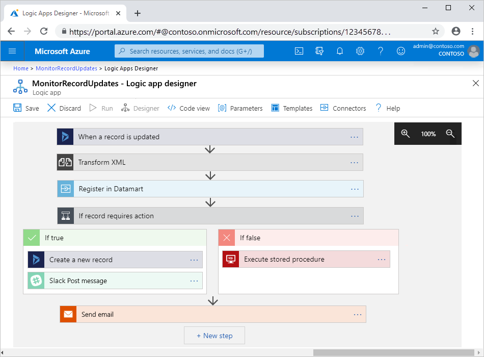

# What is Azure Logic Apps?

[Azure Logic Apps](https://azure.microsoft.com/en-gb/services/logic-apps/) is a cloud service that helps you schedule, automate, and orchestrate tasks, business processes, and [workflows](https://docs.microsoft.com/en-us/azure/logic-apps/logic-apps-overview#logic-app-concepts) when you need to integrate apps, data, systems, and services across enterprises or organizations. Logic Apps simplifies how you design and build scalable solutions for app [integration](https://azure.microsoft.com/en-gb/product-categories/integration/), data integration, system integration, enterprise application integration (EAI), and business-to-business (B2B) communication, whether in the cloud, on premises, or both.

For example, here are just a few workloads you can automate with logic apps:

- Process and route orders across on-premises systems and cloud services.
- Send email notifications with Office 365 when events happen in various systems, apps, and services.
- Move uploaded files from an SFTP or FTP server to Azure Storage.
- Monitor tweets for a specific subject, analyze the sentiment, and create alerts or tasks for items that need review.

To build enterprise integration solutions with Azure Logic Apps, you can choose from a growing gallery with hundreds of ready-to-use connectors, which include services such as Azure Service Bus, Azure Functions, Azure Storage, SQL Server, Office 365, Dynamics, Salesforce, BizTalk, SAP, Oracle DB, file shares, and more. Connectors provide triggers, actions, or both for creating logic apps that securely access and process data in real time.

## How does Logic Apps work?
Every logic app workflow starts with a trigger, which fires when a specific event happens, or when new available data meets specific criteria. Many triggers provided by the connectors in Logic Apps include basic scheduling capabilities so that you can set up how regularly your workloads run. For more complex scheduling or advanced recurrences, you can use a Recurrence trigger as the first step in any workflow. Learn more about schedule-based workflows.

Each time that the trigger fires, the Logic Apps engine creates a logic app instance that runs the actions in the workflow. These actions can also include data conversions and flow controls, such as conditional statements, switch statements, loops, and branching. For example, this logic app starts with a Dynamics 365 trigger with the built-in criteria "When a record is updated". If the trigger detects an event that matches this criteria, the trigger fires and runs the workflow's actions. Here, these actions include XML transformation, data updates, decision branching, and email notifications.

You can build your logic apps visually with the Logic Apps Designer, which is available in the Azure portal through your browser and in Visual Studio. For more custom logic apps, you can create or edit logic app definitions in JavaScript Object Notation (JSON) by working in the "code view" editor. You can also use Azure PowerShell commands and Azure Resource Manager templates for select tasks. Logic apps deploy and run in the cloud on Azure. For a more detailed introduction, watch this video: [Use Azure Enterprise Integration Services to run cloud apps at scale](https://channel9.msdn.com/Events/Connect/2017/T119/)

~~~mermaid
sequenceDiagram
    Alice->>John: Hello John, how are you?
    John-->>Alice: Great!
~~~

Woohoo - There you go Carlo!
